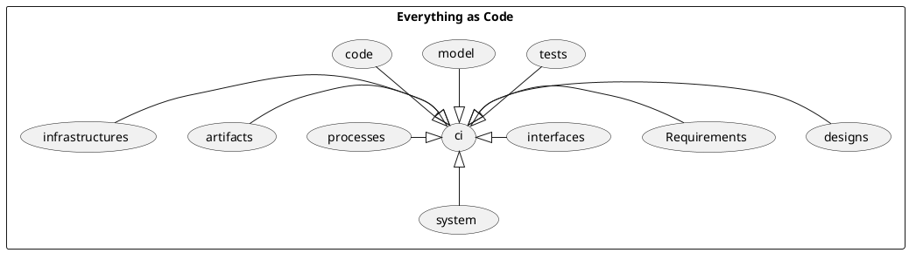

# Context Level

everything within a software project can be threated as code.

code has the following properties:

it can be reverted
it can be validated
it can be check for varous non-functional properties
it is text based( human readable)
it has strong syntax
it has  semantic meanings
it can be compiled to a machine langange
