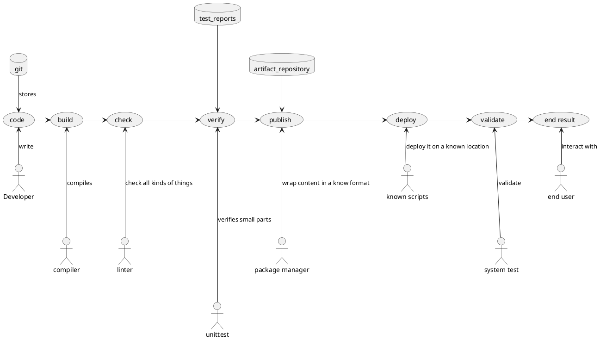

# Diagram for code

```plantuml
@startuml
    database git
    database test_reports
    database artifact_repository
    (code)->(build)
    (build)->(check)
    (check)->(verify)
    (verify)->(publish)
    (publish)->(deploy)
    (deploy)->(validate)
    (validate)->(end result)

    git -down->code : stores
    test_reports -down-->verify
    artifact_repository-down->publish
    Developer -up-> (code) : write
    compiler --up-> (build): compiles
    linter --up-> (check): check all kinds of things
    unittest ---up-> (verify): verifies small parts
    :package manager: --up-> (publish): wrap content in a know format
    :known scripts: -up-> (deploy): deploy it on a known location
    :system test: --up-> (validate): validate
    :end user: -up-> (end result):interact with
@enduml
```