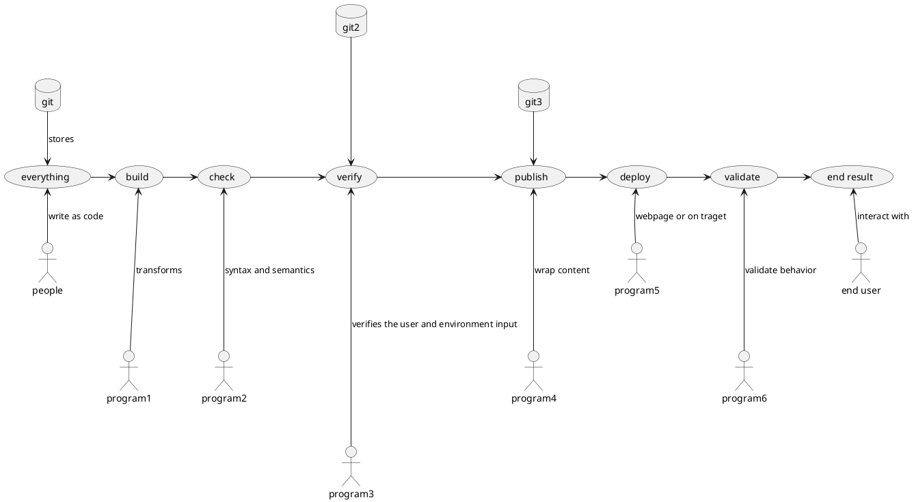

# Everything fits in this model

```plantuml 
    @startuml
      database git
      database git2
      database git3
    (everything)->(build)
    (build)->(check)
    (check)->(verify)
    (verify)->(publish)
    (publish)->(deploy)
    (deploy)->(validate)
    (validate)->(end result)
    git -down->everything : stores
    git2 -down-->verify
    git3-down->publish
    people -up-> (everything) : write as code
    program1 --up-> (build): transforms
    program2 --up-> (check): syntax and semantics
    program3 ---up-> (verify): verifies the user and environment input
    program4 --up-> (publish): wrap content
    program5 -up-> (deploy): webpage or on traget
    program6 --up-> (validate): validate behavior
    :end user: -up-> (end result):interact with
      @enduml
```